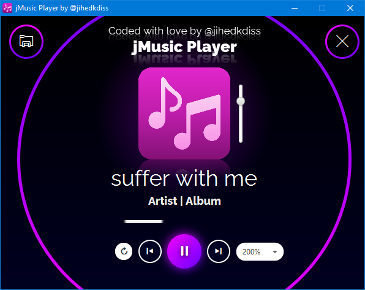

[![Contributors][contributors-shield]][contributors-url]
[![Forks][forks-shield]][forks-url]
[![Stargazers][stars-shield]][stars-url]
[![Issues][issues-shield]][issues-url]
[![MIT License][license-shield]][license-url]
[![LinkedIn][linkedin-shield]][linkedin-url]

<!-- PROJECT LOGO -->
 

  

  <h3 align="center">jMusic</h3>

  

    Music Player coded in JavaFX
     
    <a href="https://github.com/jihedkdiss/jMusic"><strong>Explore the repository »</strong></a>
     
     
    <a href="https://github.com/jihedkdiss/jMusic">View Code</a>
    ·
    <a href="https://github.com/jihedkdiss/jMusic/issues">Report Bug</a>
    ·
    <a href="https://github.com/jihedkdiss/jMusic/issues">Request Feature</a>
  

<!-- TABLE OF CONTENTS -->

  
Table of Contents

  <ol>
    <li>
      <a href="#about-the-project">About The Project</a>
      <ul>
        <li><a href="#built-with">Built With</a></li>
      </ul>
    </li>
    <li><a href="#usage">Usage</a></li>
    <li><a href="#roadmap">Roadmap</a></li>
    <li><a href="#contributing">Contributing</a></li>
    <li><a href="#license">License</a></li>
    <li><a href="#contact">Contact</a></li>
  </ol>

<!-- ABOUT THE PROJECT -->
## About The Project

  

<b>jMusic</b> is an open-source GUI music player coded in Java. The UI is built using JavaFX and SceneBuilder as UI Builder.
The app relies mainly on the MediaPlayer class providing the controls for playing media although many other classes were used.
You can support the development of jMusic by starring this repository! 🌟

### Features

* Very clean and modern interface with easy user experience
* A nice logo that will brighten your desktop ;)
* Coded with love by me =D

### Built With

* [Java](https://en.wikipedia.org/wiki/Java_programming_language)
* [JavaFX](https://openjfx.io/)
* [Gluon SceneBuilder](https://gluonhq.com/products/scene-builder/)

## Usage
1. Download the code (A redistributable release is under development)
2. Compile and Run (make sure you have JDK/JRE installed)
3. Enjoy listening to music! :)

<!-- ROADMAP -->
## Roadmap

See the [open issues](https://github.com/jihedkdiss/jMusic/issues) for a list of proposed features (and known issues).

<!-- CONTRIBUTING -->
## Contributing

Contributions are what make the open source community such an amazing place to be learn, inspire, and create. Any contributions you make are **greatly appreciated**.

1. Fork the Project
2. Create your Feature Branch (`git checkout -b feature/AmazingFeature`)
3. Commit your Changes (`git commit -m 'Add some AmazingFeature'`)
4. Push to the Branch (`git push origin feature/AmazingFeature`)
5. Open a Pull Request

<!-- LICENSE -->
## License

Distributed under the GNU General Public License. See `LICENSE` for more information.

<!-- CONTACT -->
## Contact

Jihed Kdiss - [@jiokdiss](https://facebook.com/jiokdiss) - jihedkdiss@outlook.com

Project Link: [https://github.com/jihedkdiss/jMusic](https://github.com/jihedkdiss/jMusic)

<!-- MARKDOWN LINKS & IMAGES -->
<!-- https://www.markdownguide.org/basic-syntax/#reference-style-links -->
[contributors-shield]: https://img.shields.io/github/contributors/jihedkdiss/jMusic.svg?style=for-the-badge
[contributors-url]: https://github.com/jihedkdiss/jMusic/graphs/contributors
[forks-shield]: https://img.shields.io/github/forks/jihedkdiss/jMusic.svg?style=for-the-badge
[forks-url]: https://github.com/jihedkdiss/jMusic/network/members
[stars-shield]: https://img.shields.io/github/stars/jihedkdiss/jMusic.svg?style=for-the-badge
[stars-url]: https://github.com/jihedkdiss/jMusic/stargazers
[issues-shield]: https://img.shields.io/github/issues/jihedkdiss/jMusic.svg?style=for-the-badge
[issues-url]: https://github.com/jihedkdiss/jMusic/issues
[license-shield]: https://img.shields.io/github/license/jihedkdiss/jMusic.svg?style=for-the-badge
[license-url]: https://github.com/jihedkdiss/jMusic/blob/master/LICENSE.txt
[linkedin-shield]: https://img.shields.io/badge/-LinkedIn-black.svg?style=for-the-badge&logo=linkedin&colorB=555
[linkedin-url]: https://linkedin.com/in/jihedkdiss
